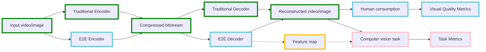

# CompressAI-Vision

*for complete documentation, please go directly to (TODO: link)*

## Synopsis

CompressAI-Vision helps you to develop, test and evaluate compression models with standardized tests in the context of "video coding for machines" (**VCM**), i.e. compression methods optimized for machine tasks algorithms such as Neural-Network (NN)-based detectors

End-to-end NN-based image and video coding models can be evaluated using various metrics, say SSIM and PNSR, like in [CompressAI](https://interdigitalinc.github.io/CompressAI), but also against image detection and segmentation tasks.


Following is a pipeline of video/image compression for machine vision task.
End-to-end compression model for human consumption (components in blue box) are implemented with Interdigital CompressAI library. Our library is a companion of CompressAI and implements the computer vision task and corresponding evaluations (pink boxes). Furthermore, we also provide support for traditional codec (for example, VTM codec) so the user can benchmark their model with the performance of traditional codec. In the future, we are also going to include support of using feature map as input of computer vision tasks.


A typical metric for evaluating the encoder's efficiency for serving a detection/segmentation task, is the mean Average Precision (mAP) as a function of encoding/quality parameters:

TODO: add a figure here

For testing VCM pipelines, various mAP measures (as in COCO or OpenImageV6 evaluation protocols) and datasets can be used, while the deep-learning CompressAI-based models are typically compared againts a well-known "anchor" pipeline, featuring a classical image/video codec, say, H266.

In particular, CompressAI-Vision supports part of the Common Test Conditions defined by the Ad-hoc Group **MPEG/VCM**, part of the ISO/MPEG working group 3, including standardized data/image sets (typically OpenImageV6 subsets), evaluation protocols (OpenImageV6) and anchor pipelines based on the compression using the state-of-the-art H.266/VCC codec.

## Features

CompressAI-Vision facilitates the handling and evaluation of VCM pipelines:

- It uses [fiftyone](https://voxel51.com/docs/fiftyone/) for dataset downloading, handling, visualization and evaluation protocols (fiftyone supports several evaluation protocols)

- Currently supports [CompressAI](https://interdigitalinc.github.io/CompressAI), [VTM](https://vcgit.hhi.fraunhofer.de/jvet/VVCSoftware_VTM) and custom modules for the encoding/decoding part. More to come!

- Uses [Detectron2](https://detectron2.readthedocs.io/en/latest/index.html) as detector and image segmentation models

# TODO (fracape) make it sound like it's one option
- Supports official MPEG committee input files (TODO: link to MPEG/VCM document?)

- Single-shot CLI commands for fast input file import, image download and evaluation

- Docker images, including all required components (CompressAI, VTM, Detectron2, CUDA support) are provided to get you started

Tutorials, API documentation and notebook examples are provided so please, go to the documentation to get started (TODO: link here)

## Installation

The software stack looks like this (all with CUDA support):

- [PyTorch](https://pytorch.org/)
- [CompressAI](https://interdigitalinc.github.io/CompressAI)
- [Detectron2](https://detectron2.readthedocs.io/en/latest/index.html)
- [fiftyone](https://voxel51.com/docs/fiftyone/)
- [VTM](https://vcgit.hhi.fraunhofer.de/jvet/VVCSoftware_VTM)
- _This_ library (CompressAI-Vision)

### Virtualenv

To get started locally and install the development version of CompressAI-Vision, run
first create a [virtual environment](https://docs.python.org/3.8/library/venv.html) with python>=3.8:

Bash scripts are provided to get proper installation of dependencies. To get default versions and CompressAI from PyPI, just run
```
bash bash/install.sh
```
within your virtual environment.

Please run
```
bash bash/install.sh --help
```
for more .

Docker images including the software stack are also provided (TODO: link).

## For developers

### Testing

Until a proper test pipeline is established, for the absolute minimal testing, you can use this command to see that's nothing accutely broken:
```
compressai-vision-info
```

### Contributing

Code is formatted using black (install with ``pip3 install --user black``).

The CI pipeline checks for your code formatting, so be sure that it conforms to black before committing.  To do that, run (in this directory):
```
black --check --diff compressai_vision
```
To apply the formatting, run
```
black compressai_vision
```
You might want to install the "black formatter" extension if you're into VSCode.

### Compiling documentation

You need to install the [furo theme](https://github.com/pradyunsg/furo).  A good idea is to install it into the same virtualenv as all the other stuff.

You need also this:
```
sudo apt-get install pandoc
```

Tutorials are produced from notebooks that are in [docs/source/tutorials](docs/source/tutorials).  If you update the notebooks, first you need to run ``compile.bash`` therein.

To produce the html documentation, run in [docs/](docs/):
```
make html
```
The go with your browser to [docs/index.html](docs/index.html)

## License

CompressAI-Vision is licensed under the BSD 3-Clause Clear License

## Authors

Sampsa Riikonen, Jacky Yat-Hong Lam, Fabien Racapé
