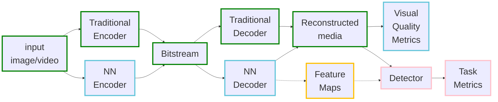

CompressAI-Vision helps you to develop, test and evaluate compression models with standardized tests in the context of "Video Coding for Machines" (VCM), i.e. compression methods optimized for machine tasks algorithms such as Neural-Network (NN)-based detectors.

End-to-end NN-based compression models as well as traditional codecs can be evaluated and compared using full pipelines including compression/decompression and task algorithm such that performances can be measured as bit-stream bit-rate vs. task accuracy.

The figure below shows supported pipelines of video/image compression for machine vision task.
End-to-end compression model for human consumption (components in blue box) can for instance be implemented using the [CompressAI](https://interdigitalinc.github.io/CompressAI), but new custom models and pipeline can be easily added to the modular API.The library then manages datasets and runs the corresponding computer vision task and corresponding evaluations (pink boxes). Traditional codecs are also supported (currently the state-of-the-art H.266/VVC reference software VTM) so you can benchmark your model against relevant standards. In the future, we are also going to include support of using feature map as input of computer vision tasks.



CompressAI-Vision notably supports parts of the Common Test Conditions defined by the ISO/MPEG VCM Ad-hoc Group, including standardized datasets (typically OpenImageV6 subsets), evaluation protocols (OpenImageV6) and anchor pipelines based on the compression using the state-of-the-art H.266/VCC codec.

## Features

CompressAI-Vision facilitates the handling and evaluation of VCM pipelines:

- Single-shot CLI commands for fast input file import, image download and evaluation

- It uses [fiftyone](https://voxel51.com/docs/fiftyone/) for dataset downloading, handling, visualization and evaluation protocols (fiftyone supports several evaluation protocols)

- Currently supports [CompressAI](https://interdigitalinc.github.io/CompressAI), [VTM](https://vcgit.hhi.fraunhofer.de/jvet/VVCSoftware_VTM) and custom modules for the encoding/decoding part. More to come!

- Currently uses [Detectron2](https://detectron2.readthedocs.io/en/latest/index.html) as detector and image segmentation models

- Docker images, including all required components (CompressAI, VTM, Detectron2, CUDA support) are provided to get you started

- Currently supports the image detection pipeline as defined in the evaluation framework by MPEG/VCM)

## Documentation

A complete documentation is provided [here](https://interdigitalinc.github.io/CompressAI-Vision/index.html), including [installation](https://interdigitalinc.github.io/CompressAI-Vision/installation), [CLI usage](https://interdigitalinc.github.io/CompressAI-Vision/cli_usage.html), as well as [tutorials](https://interdigitalinc.github.io/CompressAI-Vision/tutorials).

## installation

To get started locally and install the development version of CompressAI-Vision, first create a [virtual environment](https://docs.python.org/3.8/library/venv.html) with python>=3.8:

Bash scripts are provided to get proper installation of dependencies. To get default versions and CompressAI from PyPI, just run
```
bash scripts/install.sh
```
within your virtual environment.

For more otions, check:
```
bash scritps/install.sh --help
```

The software stack includes (all with CUDA support):

- [PyTorch](https://pytorch.org/)
- [CompressAI](https://interdigitalinc.github.io/CompressAI)
- [Detectron2](https://detectron2.readthedocs.io/en/latest/index.html)
- [fiftyone](https://voxel51.com/docs/fiftyone/)
- [VTM](https://vcgit.hhi.fraunhofer.de/jvet/VVCSoftware_VTM)
- _This_ library (CompressAI-Vision)

Docker files including the software stack are also provided!

## For developers

### Testing

Until a proper test pipeline is established, for the absolute minimal testing, you can use this command to see that's nothing accutely broken:
```
compressai-vision-info
```

After your dev, you can run (and adapt) test scripts from the scripts/tests directory. Please check scripts/tests/Readme.md for more details


### Contributing

Code is formatted using black and isort. Current checks at Pull Request also include flake8

### Compiling documentation

You need to install the [furo theme](https://github.com/pradyunsg/furo), as well as pandoc:
```
sudo apt-get install pandoc
```

Tutorials are produced from notebooks that are in [docs/source/tutorials](docs/source/tutorials).  If you update the notebooks, first you need to run ``compile.bash`` therein.

To produce the html documentation, from [docs/](docs/), run:
```
make html
```
To check the pages locally, open [docs/_build/html/index.html](docs/index.html)

## License

CompressAI-Vision is licensed under the BSD 3-Clause Clear License

## Authors

Sampsa Riikonen, Jacky Yat-Hong Lam, Fabien Racapé
