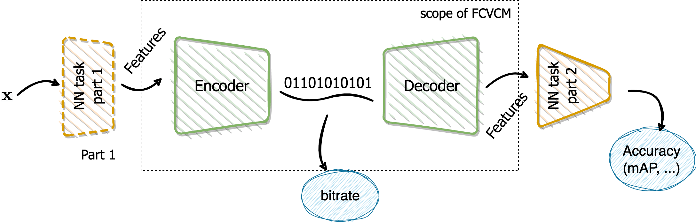

CompressAIVision
================

CompressAI-Vision helps you to develop, test and evaluate compression models with standardized tests in the context of "Video Coding for Machines" (VCM), i.e. compression methods optimized for machine tasks algorithms such as Neural-Network (NN)-based detectors.

.. .. mermaid::

..    graph LR
..       A[input image/video]:::other -->B
..       A --> B1
..       B[Traditional Encoder]:::other --> C
..       B1[NN Encoder]:::cai--> C
..       C[Bitstream]:::other --> D
..       C --> D1
..       D[Traditional Decoder]:::other--> E
..       D1[NN Decoder]:::cai-->E
..       D1 -.-> H
..       E[Reconstructed media]:::other--> G
..       E --> F1
..       G[Visual Quality Metrics]:::cai
..       F1[Detector]:::cav --> G1[Task Metrics]:::cav
..       H[Feature Maps]:::future -.-> F1
..       classDef cai stroke:#63C5DA,stroke-width:4px
..       classDef cav stroke:#FFC0CB,stroke-width:4px
..       classDef other stroke:#008000,stroke-width:4px
..       classDef future stroke:#FFBF00,stroke-width:4px

- CompressAI-Vision supports the Common Test Conditions defined by the ISO/MPEG FCVCM Ad-hoc Group, including standardized datasets (typically OpenImageV6 subsets), evaluation protocols (OpenImageV6) and anchor pipelines based on the compression using the state-of-the-art H.266/VCC codec.

To get started, please go to through the installation steps

.. toctree::
   :maxdepth: 2
   :caption: Setup

   installation

.. toctree::
   :maxdepth: 2
   :caption: Library API

   codec/index.rst
   evaluators/index.rst
   pipelines/index.rst
   model_wrappers/index.rst

.. toctree::
  :maxdepth: 2
  :caption: Datasets

  datasets

.. toctree::
   :caption: Development

   Github repository <https://github.com/InterDigitalInc/CompressAI-Vision>
