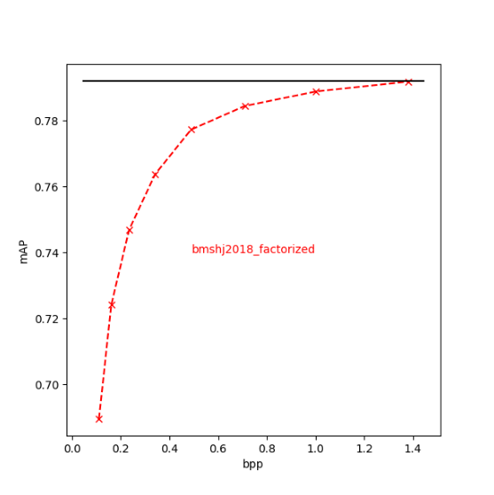
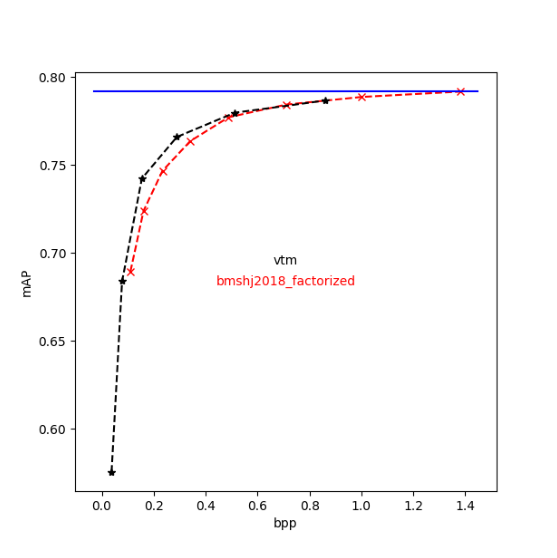

In this chapter you will learn:

-  to create mAP=mAP(bpp) plots from compressai-vision result files

Some example results, produced with the ``detectron2-eval`` command for
compressai zoo’s “bmshj2018-factorized” model have been archived into
`examples/data/interdigital/bmshj2018-factorized/ <https://github.com/InterDigitalInc/CompressAI-Vision-Internal/tree/main/examples/data/interdigital/bmshj2018-factorized>`__,
where we have:

::

   1.json
   2.json
   3.json
   4.json
   5.json
   6.json
   7.json
   8.json

These are results from a parallel run, where
``compressai-vision detectron2-eval`` was run in parallel for each
quality parameter.

Now we can use ``compressai-vision plot`` to plot the results:

.. code:: ipython3

    !compressai-vision plot --dirs={path_to_examples}/data/interdigital/bmshj2018_factorized \
    --symbols=x--r --names=bmshj2018_factorized --eval=0.792,-k

.. parsed-literal::

    reading /home/sampsa/silo/interdigital/CompressAI-Vision/examples/data/interdigital/bmshj2018_factorized/2.json
    reading /home/sampsa/silo/interdigital/CompressAI-Vision/examples/data/interdigital/bmshj2018_factorized/1.json
    reading /home/sampsa/silo/interdigital/CompressAI-Vision/examples/data/interdigital/bmshj2018_factorized/8.json
    reading /home/sampsa/silo/interdigital/CompressAI-Vision/examples/data/interdigital/bmshj2018_factorized/7.json
    reading /home/sampsa/silo/interdigital/CompressAI-Vision/examples/data/interdigital/bmshj2018_factorized/4.json
    reading /home/sampsa/silo/interdigital/CompressAI-Vision/examples/data/interdigital/bmshj2018_factorized/6.json
    reading /home/sampsa/silo/interdigital/CompressAI-Vision/examples/data/interdigital/bmshj2018_factorized/5.json
    reading /home/sampsa/silo/interdigital/CompressAI-Vision/examples/data/interdigital/bmshj2018_factorized/3.json
    --> producing out.png to current path
    have a nice day!

Let’s see how that looks like:

We can add several plots to the same image. Let’s add VTM baseline
accuracy from ``examples/data/interdigital/vtm_scale_100``:

.. code:: ipython3

    !compressai-vision plot --dirs={path_to_examples}/data/interdigital/bmshj2018_factorized,{path_to_examples}/data/interdigital/vtm_scale_100 \
    --symbols=x--r,*--k --names=bmshj2018_factorized,vtm --eval=0.792,-b

.. parsed-literal::

    reading /home/sampsa/silo/interdigital/CompressAI-Vision/examples/data/interdigital/bmshj2018_factorized/2.json
    reading /home/sampsa/silo/interdigital/CompressAI-Vision/examples/data/interdigital/bmshj2018_factorized/1.json
    reading /home/sampsa/silo/interdigital/CompressAI-Vision/examples/data/interdigital/bmshj2018_factorized/8.json
    reading /home/sampsa/silo/interdigital/CompressAI-Vision/examples/data/interdigital/bmshj2018_factorized/7.json
    reading /home/sampsa/silo/interdigital/CompressAI-Vision/examples/data/interdigital/bmshj2018_factorized/4.json
    reading /home/sampsa/silo/interdigital/CompressAI-Vision/examples/data/interdigital/bmshj2018_factorized/6.json
    reading /home/sampsa/silo/interdigital/CompressAI-Vision/examples/data/interdigital/bmshj2018_factorized/5.json
    reading /home/sampsa/silo/interdigital/CompressAI-Vision/examples/data/interdigital/bmshj2018_factorized/3.json
    reading /home/sampsa/silo/interdigital/CompressAI-Vision/examples/data/interdigital/vtm_scale_100/vtm_37.json
    reading /home/sampsa/silo/interdigital/CompressAI-Vision/examples/data/interdigital/vtm_scale_100/vtm_32.json
    reading /home/sampsa/silo/interdigital/CompressAI-Vision/examples/data/interdigital/vtm_scale_100/vtm_47.json
    reading /home/sampsa/silo/interdigital/CompressAI-Vision/examples/data/interdigital/vtm_scale_100/vtm_27.json
    reading /home/sampsa/silo/interdigital/CompressAI-Vision/examples/data/interdigital/vtm_scale_100/vtm_42.json
    reading /home/sampsa/silo/interdigital/CompressAI-Vision/examples/data/interdigital/vtm_scale_100/vtm_22.json
    --> producing out.png to current path
    have a nice day!

That looks like:

The ``plot`` command can also be used to produce csv files from the
results json files. Please refer to ``compressai-vision plot -h``.

