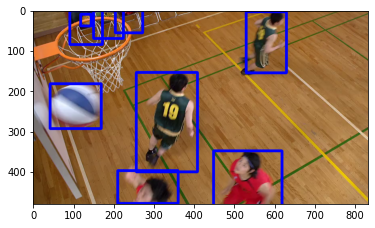

Tutorial, chapter 7
===================

In this tutorial you will learn how to

-  Convert and import the ``sfu-hw-objects-v1`` custom video dataset
-  Visualize frames from the video dataset

.. code:: ipython3

    tree {path_to_sfu_hw_objects_v1} --filelimit=10 | cat

.. parsed-literal::

    /home/sampsa/silo/interdigital/mock/SFU-HW-Objects-v1
    ├── ClassC
    │   ├── Annotations
    │   │   └── BasketballDrill [505 entries exceeds filelimit, not opening dir]
    │   └── BasketballDrill_832x480_50Hz_8bit_P420.yuv
    └── ClassX
        ├── Annotations
        │   └── BasketballDrill
        │       ├── BasketballDrill_832x480_50_seq_001.txt
        │       ├── BasketballDrill_832x480_50_seq_002.txt
        │       ├── BasketballDrill_832x480_50_seq_003.txt
        │       ├── BasketballDrill_832x480_50_seq_004.txt
        │       ├── BasketballDrill_832x480_object.list
        │       ├── video.mkv
        │       ├── video.mp4
        │       └── video.webm
        └── BasketballDrill_832x480_50Hz_8bit_P420.yuv -> /home/sampsa/silo/interdigital/mock/SFU-HW-Objects-v1/ClassC/BasketballDrill_832x480_50Hz_8bit_P420.yuv
    
    6 directories, 10 files

.. code:: ipython3

    compressai-vision convert-video --dataset-type=sfu-hw-objects-v1 --dir={path_to_sfu_hw_objects_v1} --y

.. parsed-literal::

    
    Converting raw video proper container format
    
    Dataset type           :  sfu-hw-objects-v1
    Dataset root directory :  /home/sampsa/silo/interdigital/mock/SFU-HW-Objects-v1
    
    finding .yuv files from /home/sampsa/silo/interdigital/mock/SFU-HW-Objects-v1
    ffmpeg -y -f rawvideo -pixel_format yuv420p -video_size 832x480 -i /home/sampsa/silo/interdigital/mock/SFU-HW-Objects-v1/ClassC/BasketballDrill_832x480_50Hz_8bit_P420.yuv -an -c:v h264 -q 0 -r 50 /home/sampsa/silo/interdigital/mock/SFU-HW-Objects-v1/ClassC/Annotations/BasketballDrill/video.mp4
    ffmpeg version 4.2.7-0ubuntu0.1 Copyright (c) 2000-2022 the FFmpeg developers
      built with gcc 9 (Ubuntu 9.4.0-1ubuntu1~20.04.1)
      configuration: --prefix=/usr --extra-version=0ubuntu0.1 --toolchain=hardened --libdir=/usr/lib/x86_64-linux-gnu --incdir=/usr/include/x86_64-linux-gnu --arch=amd64 --enable-gpl --disable-stripping --enable-avresample --disable-filter=resample --enable-avisynth --enable-gnutls --enable-ladspa --enable-libaom --enable-libass --enable-libbluray --enable-libbs2b --enable-libcaca --enable-libcdio --enable-libcodec2 --enable-libflite --enable-libfontconfig --enable-libfreetype --enable-libfribidi --enable-libgme --enable-libgsm --enable-libjack --enable-libmp3lame --enable-libmysofa --enable-libopenjpeg --enable-libopenmpt --enable-libopus --enable-libpulse --enable-librsvg --enable-librubberband --enable-libshine --enable-libsnappy --enable-libsoxr --enable-libspeex --enable-libssh --enable-libtheora --enable-libtwolame --enable-libvidstab --enable-libvorbis --enable-libvpx --enable-libwavpack --enable-libwebp --enable-libx265 --enable-libxml2 --enable-libxvid --enable-libzmq --enable-libzvbi --enable-lv2 --enable-omx --enable-openal --enable-opencl --enable-opengl --enable-sdl2 --enable-libdc1394 --enable-libdrm --enable-libiec61883 --enable-nvenc --enable-chromaprint --enable-frei0r --enable-libx264 --enable-shared
      libavutil      56. 31.100 / 56. 31.100
      libavcodec     58. 54.100 / 58. 54.100
      libavformat    58. 29.100 / 58. 29.100
      libavdevice    58.  8.100 / 58.  8.100
      libavfilter     7. 57.100 /  7. 57.100
      libavresample   4.  0.  0 /  4.  0.  0
      libswscale      5.  5.100 /  5.  5.100
      libswresample   3.  5.100 /  3.  5.100
      libpostproc    55.  5.100 / 55.  5.100
    [rawvideo @ 0x55e5c25a47c0] Estimating duration from bitrate, this may be inaccurate
    Input #0, rawvideo, from '/home/sampsa/silo/interdigital/mock/SFU-HW-Objects-v1/ClassC/BasketballDrill_832x480_50Hz_8bit_P420.yuv':
      Duration: 00:00:20.04, start: 0.000000, bitrate: 119808 kb/s
        Stream #0:0: Video: rawvideo (I420 / 0x30323449), yuv420p, 832x480, 119808 kb/s, 25 tbr, 25 tbn, 25 tbc
    Stream mapping:
      Stream #0:0 -> #0:0 (rawvideo (native) -> h264 (libx264))
    Press [q] to stop, [?] for help
    [libx264 @ 0x55e5c25b2000] using cpu capabilities: MMX2 SSE2Fast SSSE3 SSE4.2 AVX FMA3 BMI2 AVX2
    [libx264 @ 0x55e5c25b2000] profile High, level 3.1
    [libx264 @ 0x55e5c25b2000] 264 - core 155 r2917 0a84d98 - H.264/MPEG-4 AVC codec - Copyleft 2003-2018 - http://www.videolan.org/x264.html - options: cabac=1 ref=3 deblock=1:0:0 analyse=0x3:0x113 me=hex subme=7 psy=1 psy_rd=1.00:0.00 mixed_ref=1 me_range=16 chroma_me=1 trellis=1 8x8dct=1 cqm=0 deadzone=21,11 fast_pskip=1 chroma_qp_offset=-2 threads=12 lookahead_threads=2 sliced_threads=0 nr=0 decimate=1 interlaced=0 bluray_compat=0 constrained_intra=0 bframes=3 b_pyramid=2 b_adapt=1 b_bias=0 direct=1 weightb=1 open_gop=0 weightp=2 keyint=250 keyint_min=25 scenecut=40 intra_refresh=0 rc_lookahead=40 rc=crf mbtree=1 crf=23.0 qcomp=0.60 qpmin=0 qpmax=69 qpstep=4 ip_ratio=1.40 aq=1:1.00
    Output #0, mp4, to '/home/sampsa/silo/interdigital/mock/SFU-HW-Objects-v1/ClassC/Annotations/BasketballDrill/video.mp4':
      Metadata:
        encoder         : Lavf58.29.100
        Stream #0:0: Video: h264 (libx264) (avc1 / 0x31637661), yuv420p, 832x480, q=-1--1, 50 fps, 12800 tbn, 50 tbc
        Metadata:
          encoder         : Lavc58.54.100 libx264
        Side data:
          cpb: bitrate max/min/avg: 0/0/0 buffer size: 0 vbv_delay: -1
    frame= 1002 fps=203 q=-1.0 Lsize=    4188kB time=00:00:19.98 bitrate=1717.2kbits/s dup=501 drop=0 speed=4.04x    
    video:4176kB audio:0kB subtitle:0kB other streams:0kB global headers:0kB muxing overhead: 0.301671%
    [libx264 @ 0x55e5c25b2000] frame I:5     Avg QP:23.20  size: 57827
    [libx264 @ 0x55e5c25b2000] frame P:253   Avg QP:25.76  size: 11964
    [libx264 @ 0x55e5c25b2000] frame B:744   Avg QP:30.21  size:  1289
    [libx264 @ 0x55e5c25b2000] consecutive B-frames:  1.0%  0.0%  0.0% 99.0%
    [libx264 @ 0x55e5c25b2000] mb I  I16..4:  7.5% 42.0% 50.5%
    [libx264 @ 0x55e5c25b2000] mb P  I16..4:  0.1%  5.8%  2.6%  P16..4: 42.8% 16.3% 11.0%  0.0%  0.0%    skip:21.4%
    [libx264 @ 0x55e5c25b2000] mb B  I16..4:  0.0%  0.1%  0.0%  B16..8: 25.2%  2.8%  1.0%  direct: 0.8%  skip:70.1%  L0:62.4% L1:31.1% BI: 6.6%
    [libx264 @ 0x55e5c25b2000] 8x8 transform intra:63.8% inter:66.2%
    [libx264 @ 0x55e5c25b2000] coded y,uvDC,uvAC intra: 86.7% 85.4% 59.9% inter: 11.9% 9.7% 2.4%
    [libx264 @ 0x55e5c25b2000] i16 v,h,dc,p: 52% 13%  8% 27%
    [libx264 @ 0x55e5c25b2000] i8 v,h,dc,ddl,ddr,vr,hd,vl,hu:  9%  7% 10%  6% 22% 19% 10%  8%  9%
    [libx264 @ 0x55e5c25b2000] i4 v,h,dc,ddl,ddr,vr,hd,vl,hu: 14%  8% 14%  6% 21% 16%  8%  6%  6%
    [libx264 @ 0x55e5c25b2000] i8c dc,h,v,p: 50% 16% 22% 12%
    [libx264 @ 0x55e5c25b2000] Weighted P-Frames: Y:0.0% UV:0.0%
    [libx264 @ 0x55e5c25b2000] ref P L0: 51.0% 27.4% 13.5%  8.1%
    [libx264 @ 0x55e5c25b2000] ref B L0: 87.1%  8.9%  4.0%
    [libx264 @ 0x55e5c25b2000] ref B L1: 96.1%  3.9%
    [libx264 @ 0x55e5c25b2000] kb/s:1706.65
    ffmpeg -y -f rawvideo -pixel_format yuv420p -video_size 832x480 -i /home/sampsa/silo/interdigital/mock/SFU-HW-Objects-v1/ClassX/BasketballDrill_832x480_50Hz_8bit_P420.yuv -an -c:v h264 -q 0 -r 50 /home/sampsa/silo/interdigital/mock/SFU-HW-Objects-v1/ClassX/Annotations/BasketballDrill/video.mp4
    ffmpeg version 4.2.7-0ubuntu0.1 Copyright (c) 2000-2022 the FFmpeg developers
      built with gcc 9 (Ubuntu 9.4.0-1ubuntu1~20.04.1)
      configuration: --prefix=/usr --extra-version=0ubuntu0.1 --toolchain=hardened --libdir=/usr/lib/x86_64-linux-gnu --incdir=/usr/include/x86_64-linux-gnu --arch=amd64 --enable-gpl --disable-stripping --enable-avresample --disable-filter=resample --enable-avisynth --enable-gnutls --enable-ladspa --enable-libaom --enable-libass --enable-libbluray --enable-libbs2b --enable-libcaca --enable-libcdio --enable-libcodec2 --enable-libflite --enable-libfontconfig --enable-libfreetype --enable-libfribidi --enable-libgme --enable-libgsm --enable-libjack --enable-libmp3lame --enable-libmysofa --enable-libopenjpeg --enable-libopenmpt --enable-libopus --enable-libpulse --enable-librsvg --enable-librubberband --enable-libshine --enable-libsnappy --enable-libsoxr --enable-libspeex --enable-libssh --enable-libtheora --enable-libtwolame --enable-libvidstab --enable-libvorbis --enable-libvpx --enable-libwavpack --enable-libwebp --enable-libx265 --enable-libxml2 --enable-libxvid --enable-libzmq --enable-libzvbi --enable-lv2 --enable-omx --enable-openal --enable-opencl --enable-opengl --enable-sdl2 --enable-libdc1394 --enable-libdrm --enable-libiec61883 --enable-nvenc --enable-chromaprint --enable-frei0r --enable-libx264 --enable-shared
      libavutil      56. 31.100 / 56. 31.100
      libavcodec     58. 54.100 / 58. 54.100
      libavformat    58. 29.100 / 58. 29.100
      libavdevice    58.  8.100 / 58.  8.100
      libavfilter     7. 57.100 /  7. 57.100
      libavresample   4.  0.  0 /  4.  0.  0
      libswscale      5.  5.100 /  5.  5.100
      libswresample   3.  5.100 /  3.  5.100
      libpostproc    55.  5.100 / 55.  5.100
    [rawvideo @ 0x55aacda477c0] Estimating duration from bitrate, this may be inaccurate
    Input #0, rawvideo, from '/home/sampsa/silo/interdigital/mock/SFU-HW-Objects-v1/ClassX/BasketballDrill_832x480_50Hz_8bit_P420.yuv':
      Duration: 00:00:20.04, start: 0.000000, bitrate: 119808 kb/s
        Stream #0:0: Video: rawvideo (I420 / 0x30323449), yuv420p, 832x480, 119808 kb/s, 25 tbr, 25 tbn, 25 tbc
    Stream mapping:
      Stream #0:0 -> #0:0 (rawvideo (native) -> h264 (libx264))
    Press [q] to stop, [?] for help
    [libx264 @ 0x55aacda55000] using cpu capabilities: MMX2 SSE2Fast SSSE3 SSE4.2 AVX FMA3 BMI2 AVX2
    [libx264 @ 0x55aacda55000] profile High, level 3.1
    [libx264 @ 0x55aacda55000] 264 - core 155 r2917 0a84d98 - H.264/MPEG-4 AVC codec - Copyleft 2003-2018 - http://www.videolan.org/x264.html - options: cabac=1 ref=3 deblock=1:0:0 analyse=0x3:0x113 me=hex subme=7 psy=1 psy_rd=1.00:0.00 mixed_ref=1 me_range=16 chroma_me=1 trellis=1 8x8dct=1 cqm=0 deadzone=21,11 fast_pskip=1 chroma_qp_offset=-2 threads=12 lookahead_threads=2 sliced_threads=0 nr=0 decimate=1 interlaced=0 bluray_compat=0 constrained_intra=0 bframes=3 b_pyramid=2 b_adapt=1 b_bias=0 direct=1 weightb=1 open_gop=0 weightp=2 keyint=250 keyint_min=25 scenecut=40 intra_refresh=0 rc_lookahead=40 rc=crf mbtree=1 crf=23.0 qcomp=0.60 qpmin=0 qpmax=69 qpstep=4 ip_ratio=1.40 aq=1:1.00
    Output #0, mp4, to '/home/sampsa/silo/interdigital/mock/SFU-HW-Objects-v1/ClassX/Annotations/BasketballDrill/video.mp4':
      Metadata:
        encoder         : Lavf58.29.100
        Stream #0:0: Video: h264 (libx264) (avc1 / 0x31637661), yuv420p, 832x480, q=-1--1, 50 fps, 12800 tbn, 50 tbc
        Metadata:
          encoder         : Lavc58.54.100 libx264
        Side data:
          cpb: bitrate max/min/avg: 0/0/0 buffer size: 0 vbv_delay: -1
    frame= 1002 fps=190 q=-1.0 Lsize=    4188kB time=00:00:19.98 bitrate=1717.2kbits/s dup=501 drop=0 speed=3.79x    
    video:4176kB audio:0kB subtitle:0kB other streams:0kB global headers:0kB muxing overhead: 0.301671%
    [libx264 @ 0x55aacda55000] frame I:5     Avg QP:23.20  size: 57827
    [libx264 @ 0x55aacda55000] frame P:253   Avg QP:25.76  size: 11964
    [libx264 @ 0x55aacda55000] frame B:744   Avg QP:30.21  size:  1289
    [libx264 @ 0x55aacda55000] consecutive B-frames:  1.0%  0.0%  0.0% 99.0%
    [libx264 @ 0x55aacda55000] mb I  I16..4:  7.5% 42.0% 50.5%
    [libx264 @ 0x55aacda55000] mb P  I16..4:  0.1%  5.8%  2.6%  P16..4: 42.8% 16.3% 11.0%  0.0%  0.0%    skip:21.4%
    [libx264 @ 0x55aacda55000] mb B  I16..4:  0.0%  0.1%  0.0%  B16..8: 25.2%  2.8%  1.0%  direct: 0.8%  skip:70.1%  L0:62.4% L1:31.1% BI: 6.6%
    [libx264 @ 0x55aacda55000] 8x8 transform intra:63.8% inter:66.2%
    [libx264 @ 0x55aacda55000] coded y,uvDC,uvAC intra: 86.7% 85.4% 59.9% inter: 11.9% 9.7% 2.4%
    [libx264 @ 0x55aacda55000] i16 v,h,dc,p: 52% 13%  8% 27%
    [libx264 @ 0x55aacda55000] i8 v,h,dc,ddl,ddr,vr,hd,vl,hu:  9%  7% 10%  6% 22% 19% 10%  8%  9%
    [libx264 @ 0x55aacda55000] i4 v,h,dc,ddl,ddr,vr,hd,vl,hu: 14%  8% 14%  6% 21% 16%  8%  6%  6%
    [libx264 @ 0x55aacda55000] i8c dc,h,v,p: 50% 16% 22% 12%
    [libx264 @ 0x55aacda55000] Weighted P-Frames: Y:0.0% UV:0.0%
    [libx264 @ 0x55aacda55000] ref P L0: 51.0% 27.4% 13.5%  8.1%
    [libx264 @ 0x55aacda55000] ref B L0: 87.1%  8.9%  4.0%
    [libx264 @ 0x55aacda55000] ref B L1: 96.1%  3.9%
    [libx264 @ 0x55aacda55000] kb/s:1706.65
    video conversion done

.. code:: ipython3

    compressai-vision import-video --dataset-type=sfu-hw-objects-v1 --dir={path_to_sfu_hw_objects_v1} --y

.. parsed-literal::

    importing fiftyone
    fiftyone imported
    WARNING: dataset sfu-hw-objects-v1 already exists: will delete and rewrite
    
    Importing a custom video format into fiftyone
    
    Dataset type           :  sfu-hw-objects-v1
    Dataset root directory :  /home/sampsa/silo/interdigital/mock/SFU-HW-Objects-v1
    
    searching for /home/sampsa/silo/interdigital/mock/SFU-HW-Objects-v1/Class*
    Dataset sfu-hw-objects-v1 exists.  Will remove it first
    Dataset sfu-hw-objects-v1 created
    
    In class directory /home/sampsa/silo/interdigital/mock/SFU-HW-Objects-v1/ClassC
    searching for /home/sampsa/silo/interdigital/mock/SFU-HW-Objects-v1/ClassC/Annotations/*
    --> registering video /home/sampsa/silo/interdigital/mock/SFU-HW-Objects-v1/ClassC/Annotations/BasketballDrill/video.mp4
    --> registered new video sample: ClassC BasketballDrill with 500 frames
    
    In class directory /home/sampsa/silo/interdigital/mock/SFU-HW-Objects-v1/ClassX
    searching for /home/sampsa/silo/interdigital/mock/SFU-HW-Objects-v1/ClassX/Annotations/*
    --> registering video /home/sampsa/silo/interdigital/mock/SFU-HW-Objects-v1/ClassX/Annotations/BasketballDrill/video.mp4
    --> registered new video sample: ClassX BasketballDrill with 4 frames
    
    Dataset saved

Let’s continue in a python notebook:

.. code:: ipython3

    import cv2
    import matplotlib.pyplot as plt
    import fiftyone as fo
    from fiftyone import ViewField as F

.. code:: ipython3

    dataset=fo.load_dataset("sfu-hw-objects-v1")

.. code:: ipython3

    dataset

.. parsed-literal::

    Name:        sfu-hw-objects-v1
    Media type:  video
    Num samples: 2
    Persistent:  True
    Tags:        []
    Sample fields:
        id:         fiftyone.core.fields.ObjectIdField
        filepath:   fiftyone.core.fields.StringField
        tags:       fiftyone.core.fields.ListField(fiftyone.core.fields.StringField)
        metadata:   fiftyone.core.fields.EmbeddedDocumentField(fiftyone.core.metadata.VideoMetadata)
        media_type: fiftyone.core.fields.StringField
        class_tag:  fiftyone.core.fields.StringField
        name_tag:   fiftyone.core.fields.StringField
        custom_id:  fiftyone.core.fields.StringField
    Frame fields:
        id:           fiftyone.core.fields.ObjectIdField
        frame_number: fiftyone.core.fields.FrameNumberField
        detections:   fiftyone.core.fields.EmbeddedDocumentField(fiftyone.core.labels.Detections)

In contrast to image datasets where each sample was an image, now a
sample corresponds to a video:

.. code:: ipython3

    dataset.first()

.. parsed-literal::

    <Sample: {
        'id': '6369549003c309140007ce13',
        'media_type': 'video',
        'filepath': '/home/sampsa/silo/interdigital/mock/SFU-HW-Objects-v1/ClassC/Annotations/BasketballDrill/video.mp4',
        'tags': BaseList([]),
        'metadata': None,
        'class_tag': 'ClassC',
        'name_tag': 'BasketballDrill',
        'custom_id': 'ClassC_BasketballDrill',
        'frames': <Frames: 500>,
    }>

There is a reference to the video file and a ``Frames`` object,
encapsulating ground truths etc. data for each and every frame. For
``sfu-hw-objects-v1`` in particular, ``class_tag`` corresponds to the
class directories (ClassA, ClassB, etc.), while ``name_tag`` to the
video descriptive names (BasketballDrill, Traffic, PeopleOnStreeet,
etc.). Let’s pick a certain video sample:

.. code:: ipython3

    sample = dataset[ (F("name_tag") == "BasketballDrill") & (F("class_tag") == "ClassC") ].first()

Take a look at the first frame ground truth detections (note that frame
indices start from 1):

.. code:: ipython3

    sample.frames[1]

.. parsed-literal::

    <FrameView: {
        'id': '636954903bc11cf349eb95c8',
        'frame_number': 1,
        'detections': <Detections: {
            'detections': BaseList([
                <Detection: {
                    'id': '6369548f03c309140007ba62',
                    'attributes': BaseDict({}),
                    'tags': BaseList([]),
                    'label': 'person',
                    'bounding_box': BaseList([0.2525, 0.8288, 0.1812, 0.1678]),
                    'mask': None,
                    'confidence': 1.0,
                    'index': None,
                }>,
                <Detection: {
                    'id': '6369548f03c309140007ba63',
                    'attributes': BaseDict({}),
                    'tags': BaseList([]),
                    'label': 'person',
                    'bounding_box': BaseList([0.63635, 0.00874999999999998, 0.1207, 0.3149]),
                    'mask': None,
                    'confidence': 1.0,
                    'index': None,
                }>,
                <Detection: {
                    'id': '6369548f03c309140007ba64',
                    'attributes': BaseDict({}),
                    'tags': BaseList([]),
                    'label': 'person',
                    'bounding_box': BaseList([
                        0.30820000000000003,
                        0.32125000000000004,
                        0.1828,
                        0.5125,
                    ]),
                    'mask': None,
                    'confidence': 1.0,
                    'index': None,
                }>,
                <Detection: {
                    'id': '6369548f03c309140007ba65',
                    'attributes': BaseDict({}),
                    'tags': BaseList([]),
                    'label': 'person',
                    'bounding_box': BaseList([0.5392, 0.7257, 0.2042, 0.2812]),
                    'mask': None,
                    'confidence': 1.0,
                    'index': None,
                }>,
                <Detection: {
                    'id': '6369548f03c309140007ba66',
                    'attributes': BaseDict({}),
                    'tags': BaseList([]),
                    'label': 'sports ball',
                    'bounding_box': BaseList([
                        0.045313000000000006,
                        0.37777800000000006,
                        0.160156,
                        0.2375,
                    ]),
                    'mask': None,
                    'confidence': 1.0,
                    'index': None,
                }>,
                <Detection: {
                    'id': '6369548f03c309140007ba67',
                    'attributes': BaseDict({}),
                    'tags': BaseList([]),
                    'label': 'sports ball',
                    'bounding_box': BaseList([
                        0.142969,
                        0.020833499999999998,
                        0.03125,
                        0.061111,
                    ]),
                    'mask': None,
                    'confidence': 1.0,
                    'index': None,
                }>,
                <Detection: {
                    'id': '6369548f03c309140007ba68',
                    'attributes': BaseDict({}),
                    'tags': BaseList([]),
                    'label': 'chair',
                    'bounding_box': BaseList([
                        0.11015650000000002,
                        0.002777500000000002,
                        0.096875,
                        0.176389,
                    ]),
                    'mask': None,
                    'confidence': 1.0,
                    'index': None,
                }>,
                <Detection: {
                    'id': '6369548f03c309140007ba69',
                    'attributes': BaseDict({}),
                    'tags': BaseList([]),
                    'label': 'chair',
                    'bounding_box': BaseList([
                        0.18125000000000002,
                        0.0041665000000000035,
                        0.089062,
                        0.141667,
                    ]),
                    'mask': None,
                    'confidence': 1.0,
                    'index': None,
                }>,
                <Detection: {
                    'id': '6369548f03c309140007ba6a',
                    'attributes': BaseDict({}),
                    'tags': BaseList([]),
                    'label': 'chair',
                    'bounding_box': BaseList([
                        0.2460935,
                        0.0013889999999999944,
                        0.082031,
                        0.115278,
                    ]),
                    'mask': None,
                    'confidence': 1.0,
                    'index': None,
                }>,
            ]),
        }>,
    }>

Start reading the video file with OpenCV:

.. code:: ipython3

    vid=cv2.VideoCapture(sample.filepath)

Let’s define a small helper function:

.. code:: ipython3

    def draw_detections(sample: fo.Sample, vid: cv2.VideoCapture, nframe: int):
        from math import floor
        ok = vid.set(cv2.CAP_PROP_POS_FRAMES, nframe-1)
        if not ok:
            AssertionError("seek failed")
        ok, arr = vid.read() # BGR image in arr
        if not ok:
            AssertionError("no image")
        for detection in sample.frames[nframe].detections.detections:
            x0, y0, w, h = detection.bounding_box # rel coords
            x1, y1, x2, y2 = floor(x0*arr.shape[1]), floor(y0*arr.shape[0]), floor((x0+w)*arr.shape[1]), floor((y0+h)*arr.shape[0])
            arr=cv2.rectangle(arr, (x1, y1), (x2, y2), (255, 0, 0), 5)
        return arr

.. code:: ipython3

    img=draw_detections(sample, vid, 2)
    img = img[:,:,::-1] # BGR -> RGB

.. code:: ipython3

    plt.imshow(img)

.. parsed-literal::

    <matplotlib.image.AxesImage at 0x7f205b829280>

.. code:: ipython3

    vid.release()

Visualize video and annotations in the fiftyone app:

.. code:: ipython3

    # fo.launch_app(dataset)

.. code:: ipython3

    # TODO: 
    # - polish this tutorial
    # - link reference the fiftyone video quickstart tutorial
    # - mention that the normal "register" command can be used to import standard video collection formats!
    # - next: evaluation tutorial (just the same detectron2-eval etc. command as always!) .. maybe just mentioning this is enough.. or just give an example command

