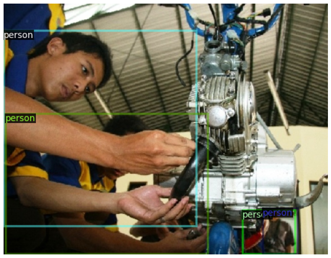

.. code:: ipython3

    # common libs
    import math, os, io, json, cv2, random, logging
    import numpy as np
    # torch
    import torch
    from torchvision import transforms
    # images
    from PIL import Image
    import matplotlib.pyplot as plt

.. code:: ipython3

    ## *** Detectron imports ***
    import detectron2
    from detectron2.utils.logger import setup_logger
    setup_logger()
    
    # import some common detectron2 utilities
    from detectron2 import model_zoo
    from detectron2.engine import DefaultPredictor
    from detectron2.config import get_cfg
    from detectron2.utils.visualizer import Visualizer
    from detectron2.data import MetadataCatalog, DatasetCatalog

.. code:: ipython3

    # CompressAI-Vision
    from compressai_vision.conversion import FO2DetectronDataset # convert fiftyone dataset to Detectron2 dataset
    from compressai_vision.conversion import detectron251 # convert Detectron2 results to fiftyone format
    from compressai_vision.evaluation.fo import annexPredictions # annex predictions from

.. code:: ipython3

    # fiftyone
    import fiftyone as fo
    import fiftyone.zoo as foz

.. code:: ipython3

    device = 'cuda' if torch.cuda.is_available() else 'cpu'
    print(device)

.. parsed-literal::

    cpu

.. code:: ipython3

    print("torch:", torch.__version__, "/ cuda:", torch.version.cuda, "/ detectron2:", detectron2.__version__)

.. parsed-literal::

    torch: 1.9.1+cu102 / cuda: 10.2 / detectron2: 0.6

Pick up correct Detectron2 model

.. code:: ipython3

    ## MODEL A
    model_name="COCO-Detection/faster_rcnn_X_101_32x8d_FPN_3x.yaml"
    ## look here:
    ## https://github.com/facebookresearch/detectron2/blob/main/MODEL_ZOO.md#faster-r-cnn
    
    ## MODEL B
    # model_name="COCO-InstanceSegmentation/mask_rcnn_R_50_FPN_3x.yaml"

.. code:: ipython3

    # cfg encapsulates the model architecture & weights, also threshold parameter, metadata, etc.
    cfg = get_cfg()
    cfg.MODEL.DEVICE=device
    # load config from a file:
    cfg.merge_from_file(model_zoo.get_config_file(model_name))
    # DO NOT TOUCH THRESHOLD WHEN DOING EVALUATION:
    # too big a threshold will cut the smallest values & affect the precision(recall) curves & evaluation results
    # the default value is 0.05
    # value of 0.01 saturates the results (they don't change at lower values)
    # cfg.MODEL.ROI_HEADS.SCORE_THRESH_TEST = 0.5
    # get weights
    cfg.MODEL.WEIGHTS = model_zoo.get_checkpoint_url(model_name)
    print("expected input colorspace:", cfg.INPUT.FORMAT)
    print("loaded datasets:", cfg.DATASETS)
    model_dataset=cfg.DATASETS.TRAIN[0]
    print("model was trained with", model_dataset)
    model_meta=MetadataCatalog.get(model_dataset)

.. parsed-literal::

    expected input colorspace: BGR
    loaded datasets: PRECOMPUTED_PROPOSAL_TOPK_TEST: 1000
    PRECOMPUTED_PROPOSAL_TOPK_TRAIN: 2000
    PROPOSAL_FILES_TEST: ()
    PROPOSAL_FILES_TRAIN: ()
    TEST: ('coco_2017_val',)
    TRAIN: ('coco_2017_train',)
    model was trained with coco_2017_train

.. code:: ipython3

    predictor = DefaultPredictor(cfg)

.. parsed-literal::

    [Checkpointer] Loading from https://dl.fbaipublicfiles.com/detectron2/COCO-Detection/faster_rcnn_X_101_32x8d_FPN_3x/139173657/model_final_68b088.pkl ...
    URL https://dl.fbaipublicfiles.com/detectron2/COCO-Detection/faster_rcnn_X_101_32x8d_FPN_3x/139173657/model_final_68b088.pkl cached in /home/sampsa/.torch/iopath_cache/detectron2/COCO-Detection/faster_rcnn_X_101_32x8d_FPN_3x/139173657/model_final_68b088.pkl
    Reading a file from 'Detectron2 Model Zoo'

Get a handle to the dataset created in previous notebooks

.. code:: ipython3

    dataset = fo.load_dataset("nokia-exported")

.. code:: ipython3

    dataset

.. parsed-literal::

    Name:        nokia-exported
    Media type:  image
    Num samples: 5000
    Persistent:  True
    Tags:        []
    Sample fields:
        id:                    fiftyone.core.fields.ObjectIdField
        filepath:              fiftyone.core.fields.StringField
        tags:                  fiftyone.core.fields.ListField(fiftyone.core.fields.StringField)
        metadata:              fiftyone.core.fields.EmbeddedDocumentField(fiftyone.core.metadata.ImageMetadata)
        positive_labels:       fiftyone.core.fields.EmbeddedDocumentField(fiftyone.core.labels.Classifications)
        negative_labels:       fiftyone.core.fields.EmbeddedDocumentField(fiftyone.core.labels.Classifications)
        detections:            fiftyone.core.fields.EmbeddedDocumentField(fiftyone.core.labels.Detections)
        open_images_id:        fiftyone.core.fields.StringField
        detectron-predictions: fiftyone.core.fields.EmbeddedDocumentField(fiftyone.core.labels.Detections)

If needed, we can go from fiftyone dataset to Detectron2 dataset:

.. code:: ipython3

    detectron_dataset=FO2DetectronDataset(fo_dataset=dataset, model_catids=model_meta.thing_classes)

Pick a sample:

.. code:: ipython3

    d=detectron_dataset[3]

We can visualize that sample also with Detectron2 library tools
(although we’d prefer fiftyone with ``fo.launch_app(dataset)``):

.. code:: ipython3

    # visualize with Detectron2 tools only
    img = cv2.imread(d["file_name"])
    visualizer = Visualizer(img[:, :, ::-1], metadata=model_meta, scale=0.5)
    out = visualizer.draw_dataset_dict(d)
    cv2_imshow(out.get_image()[:, :, ::-1])

Let’s try the Detectron2 predictor:

.. code:: ipython3

    res=predictor(img)

We can convert from Detectron2 format to fiftyone detection objects:

.. code:: ipython3

    dets=detectron251(res, model_catids=model_meta.thing_classes) # process involves going from class indexes (ints) to class labels (strings)

.. code:: ipython3

    dets

.. parsed-literal::

    <Detections: {
        'detections': BaseList([
            <Detection: {
                'id': '6303b0184179c92c4a2726b5',
                'attributes': BaseDict({}),
                'tags': BaseList([]),
                'label': 'person',
                'bounding_box': BaseList([
                    0.009324110113084316,
                    0.07061359169804884,
                    0.636555933393538,
                    0.9101487120042683,
                ]),
                'mask': None,
                'confidence': 0.9894514679908752,
                'index': None,
            }>,
            <Detection: {
                'id': '6303b0184179c92c4a2726b6',
                'attributes': BaseDict({}),
                'tags': BaseList([]),
                'label': 'person',
                'bounding_box': BaseList([
                    0.7662928700447083,
                    0.8120538199233528,
                    0.13444077968597412,
                    0.18774914350665983,
                ]),
                'mask': None,
                'confidence': 0.9372856616973877,
                'index': None,
            }>,
            <Detection: {
                'id': '6303b0184179c92c4a2726b7',
                'attributes': BaseDict({}),
                'tags': BaseList([]),
                'label': 'person',
                'bounding_box': BaseList([
                    0.6052085757255554,
                    0.8155682288382724,
                    0.20704376697540283,
                    0.18033525772383355,
                ]),
                'mask': None,
                'confidence': 0.9026966094970703,
                'index': None,
            }>,
            <Detection: {
                'id': '6303b0184179c92c4a2726b8',
                'attributes': BaseDict({}),
                'tags': BaseList([]),
                'label': 'motorcycle',
                'bounding_box': BaseList([
                    0.485452800989151,
                    0.016184425594527062,
                    0.40658149123191833,
                    0.8690680952420902,
                ]),
                'mask': None,
                'confidence': 0.7087109684944153,
                'index': None,
            }>,
            <Detection: {
                'id': '6303b0184179c92c4a2726b9',
                'attributes': BaseDict({}),
                'tags': BaseList([]),
                'label': 'person',
                'bounding_box': BaseList([
                    0.014408787712454796,
                    0.5796498013625079,
                    0.6207742486149073,
                    0.40208690975232503,
                ]),
                'mask': None,
                'confidence': 0.6055470108985901,
                'index': None,
            }>,
            <Detection: {
                'id': '6303b0184179c92c4a2726ba',
                'attributes': BaseDict({}),
                'tags': BaseList([]),
                'label': 'person',
                'bounding_box': BaseList([
                    0.2356555312871933,
                    0.4367165102483646,
                    0.26028211414813995,
                    0.4146875138541338,
                ]),
                'mask': None,
                'confidence': 0.3441943824291229,
                'index': None,
            }>,
            <Detection: {
                'id': '6303b0184179c92c4a2726bb',
                'attributes': BaseDict({}),
                'tags': BaseList([]),
                'label': 'bicycle',
                'bounding_box': BaseList([
                    0.4535953998565674,
                    0.006116752215622352,
                    0.4246022701263428,
                    0.9400808730011179,
                ]),
                'mask': None,
                'confidence': 0.291936993598938,
                'index': None,
            }>,
            <Detection: {
                'id': '6303b0184179c92c4a2726bc',
                'attributes': BaseDict({}),
                'tags': BaseList([]),
                'label': 'person',
                'bounding_box': BaseList([
                    0.7321376204490662,
                    0.8158130621699637,
                    0.10273182392120361,
                    0.1786184226729981,
                ]),
                'mask': None,
                'confidence': 0.251709520816803,
                'index': None,
            }>,
            <Detection: {
                'id': '6303b0184179c92c4a2726bd',
                'attributes': BaseDict({}),
                'tags': BaseList([]),
                'label': 'cell phone',
                'bounding_box': BaseList([
                    0.5621044039726257,
                    0.9012914515684111,
                    0.039388060569763184,
                    0.04222701506837169,
                ]),
                'mask': None,
                'confidence': 0.2146982103586197,
                'index': None,
            }>,
            <Detection: {
                'id': '6303b0184179c92c4a2726be',
                'attributes': BaseDict({}),
                'tags': BaseList([]),
                'label': 'person',
                'bounding_box': BaseList([
                    0.29376694560050964,
                    0.46854041774215793,
                    0.1675676703453064,
                    0.29636893927825503,
                ]),
                'mask': None,
                'confidence': 0.15639427304267883,
                'index': None,
            }>,
            <Detection: {
                'id': '6303b0184179c92c4a2726bf',
                'attributes': BaseDict({}),
                'tags': BaseList([]),
                'label': 'person',
                'bounding_box': BaseList([
                    0.004228693433105946,
                    0.0767963404613365,
                    0.37698595505207777,
                    0.630363829950667,
                ]),
                'mask': None,
                'confidence': 0.11882766336202621,
                'index': None,
            }>,
            <Detection: {
                'id': '6303b0184179c92c4a2726c0',
                'attributes': BaseDict({}),
                'tags': BaseList([]),
                'label': 'person',
                'bounding_box': BaseList([
                    0.6203261017799377,
                    0.865912842720484,
                    0.09154510498046875,
                    0.13247769176584173,
                ]),
                'mask': None,
                'confidence': 0.09884662926197052,
                'index': None,
            }>,
            <Detection: {
                'id': '6303b0184179c92c4a2726c1',
                'attributes': BaseDict({}),
                'tags': BaseList([]),
                'label': 'person',
                'bounding_box': BaseList([
                    0.08518574386835098,
                    0.3548633628354548,
                    0.4390302523970604,
                    0.5531069357488375,
                ]),
                'mask': None,
                'confidence': 0.0946485623717308,
                'index': None,
            }>,
            <Detection: {
                'id': '6303b0184179c92c4a2726c2',
                'attributes': BaseDict({}),
                'tags': BaseList([]),
                'label': 'motorcycle',
                'bounding_box': BaseList([
                    0.1718100905418396,
                    0.0204875556397408,
                    0.6795393824577332,
                    0.8203254449562948,
                ]),
                'mask': None,
                'confidence': 0.08924849331378937,
                'index': None,
            }>,
            <Detection: {
                'id': '6303b0184179c92c4a2726c3',
                'attributes': BaseDict({}),
                'tags': BaseList([]),
                'label': 'truck',
                'bounding_box': BaseList([
                    0.23365649580955505,
                    0.0,
                    0.7420808374881744,
                    0.9733538826056116,
                ]),
                'mask': None,
                'confidence': 0.07246677577495575,
                'index': None,
            }>,
            <Detection: {
                'id': '6303b0184179c92c4a2726c4',
                'attributes': BaseDict({}),
                'tags': BaseList([]),
                'label': 'baseball bat',
                'bounding_box': BaseList([
                    0.8032967448234558,
                    0.2696970185596134,
                    0.07617664337158203,
                    0.2461811272523743,
                ]),
                'mask': None,
                'confidence': 0.06142522394657135,
                'index': None,
            }>,
        ]),
    }>

Let’s run each image in the fiftyone dataset through the predictor.
Results from the predictor will be annexed to the same fiftyone dataset.

.. code:: ipython3

    # dataset=dataset[0:2] # enable this if you want to create dummy/testing dataset of just two images from the big dataset

.. code:: ipython3

    annexPredictions(predictor=predictor, fo_dataset=dataset)

.. parsed-literal::

     100% |█████████████████████| 2/2 [10.2s elapsed, 0s remaining, 0.2 samples/s]  

After that one, the dataset looks slightly different

.. code:: ipython3

    sample=dataset.first()

.. code:: ipython3

    ## this one was there to begin with
    # sample["detections"]

.. code:: ipython3

    ## this one has been added by running the Detectron2 predictor:
    #sample["detectron-predictions"]

Each sample in the dataset contains “detections” (ground truths) and
“detectron-predictions” (predicted values). Now we can run the
OpenImageV6 evaluation protocol on the dataset that compares the two:

.. code:: ipython3

    results = dataset.evaluate_detections(
        "detectron-predictions",
        gt_field="detections",
        method="open-images",
        pos_label_field="positive_labels",
        neg_label_field="negative_labels",
        expand_pred_hierarchy=False,
        expand_gt_hierarchy=False
    )

.. parsed-literal::

    Evaluating detections...
     100% |███████████████| 5000/5000 [57.9s elapsed, 0s remaining, 95.8 samples/s]       

OpenImageV6 evaluation protocol mAP:

.. code:: ipython3

    results.mAP()

.. parsed-literal::

    0.7927697664330146

Per class mAP:

.. code:: ipython3

    classes = dataset.distinct(
        "detections.detections.label"
    )
    for class_ in classes:
        print(class_, results.mAP([class_]))

