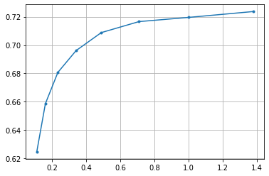

.. code:: ipython3

    # common libs
    import math, os, io, json, cv2, random, logging, pickle, datetime
    import numpy as np
    # torch
    import torch
    # images
    from PIL import Image
    import matplotlib.pyplot as plt
    # compressai
    from compressai.zoo import bmshj2018_factorized

.. code:: ipython3

    ## *** Detectron imports ***
    import detectron2
    from detectron2.utils.logger import setup_logger
    setup_logger()
    
    # import some common detectron2 utilities
    from detectron2 import model_zoo
    from detectron2.engine import DefaultPredictor
    from detectron2.config import get_cfg
    from detectron2.utils.visualizer import Visualizer
    from detectron2.data import MetadataCatalog, DatasetCatalog

.. code:: ipython3

    # CompressAI-Vision
    from compressai_vision.conversion import FO2DetectronDataset # convert fiftyone dataset to Detectron2 dataset
    from compressai_vision.conversion import detectron251 # convert Detectron2 results to fiftyone format
    from compressai_vision.evaluation.fo import annexPredictions # annex predictions from
    from compressai_vision.evaluation.pipeline import CompressAIEncoderDecoder, VTMEncoderDecoder # a class that does encoding+decoding & returns the transformed image & bitrate
    from compressai_vision.tools import confLogger, quickLog, getDataFile

.. code:: ipython3

    # fiftyone
    import fiftyone as fo
    import fiftyone.zoo as foz

.. code:: ipython3

    device = 'cuda' if torch.cuda.is_available() else 'cpu'
    print(device)

.. parsed-literal::

    cpu

.. code:: ipython3

    ## MODEL A
    model_name="COCO-Detection/faster_rcnn_X_101_32x8d_FPN_3x.yaml"
    ## look here:
    ## https://github.com/facebookresearch/detectron2/blob/main/MODEL_ZOO.md#faster-r-cnn
    ## for the line that says X101-FPN --> box AP is 43
    
    ## MODEL B
    # model_name="COCO-InstanceSegmentation/mask_rcnn_R_50_FPN_3x.yaml"

.. code:: ipython3

    # cfg encapsulates the model architecture & weights, also threshold parameter, metadata, etc.
    cfg = get_cfg()
    cfg.MODEL.DEVICE=device
    # load config from a file:
    cfg.merge_from_file(model_zoo.get_config_file(model_name))
    # DO NOT TOUCH THRESHOLD WHEN DOING EVALUATION:
    # too big a threshold will cut the smallest values & affect the precision(recall) curves & evaluation results
    # the default value is 0.05
    # value of 0.01 saturates the results (they don't change at lower values)
    # cfg.MODEL.ROI_HEADS.SCORE_THRESH_TEST = 0.5
    # get weights
    cfg.MODEL.WEIGHTS = model_zoo.get_checkpoint_url(model_name)
    print("expected input colorspace:", cfg.INPUT.FORMAT)
    print("loaded datasets:", cfg.DATASETS)
    model_dataset=cfg.DATASETS.TRAIN[0]
    print("model was trained with", model_dataset)
    model_meta=MetadataCatalog.get(model_dataset)

.. parsed-literal::

    expected input colorspace: BGR
    loaded datasets: PRECOMPUTED_PROPOSAL_TOPK_TEST: 1000
    PRECOMPUTED_PROPOSAL_TOPK_TRAIN: 2000
    PROPOSAL_FILES_TEST: ()
    PROPOSAL_FILES_TRAIN: ()
    TEST: ('coco_2017_val',)
    TRAIN: ('coco_2017_train',)
    model was trained with coco_2017_train

.. code:: ipython3

    # model_meta.thing_classes # check class labels this was trained with

.. code:: ipython3

    predictor = DefaultPredictor(cfg)

.. parsed-literal::

    [Checkpointer] Loading from https://dl.fbaipublicfiles.com/detectron2/COCO-Detection/faster_rcnn_X_101_32x8d_FPN_3x/139173657/model_final_68b088.pkl ...
    URL https://dl.fbaipublicfiles.com/detectron2/COCO-Detection/faster_rcnn_X_101_32x8d_FPN_3x/139173657/model_final_68b088.pkl cached in /home/sampsa/.torch/iopath_cache/detectron2/COCO-Detection/faster_rcnn_X_101_32x8d_FPN_3x/139173657/model_final_68b088.pkl
    Reading a file from 'Detectron2 Model Zoo'

Get a handle to the dataset created in previous notebooks:

.. code:: ipython3

    dataset = fo.load_dataset("nokia-detection")
    # dataset = fo.load_dataset("nokia-detection-dummy") # or use the dummy dataset for testing/debugging

.. code:: ipython3

    dataset

.. parsed-literal::

    Name:        nokia-detection-dummy
    Media type:  image
    Num samples: 1
    Persistent:  True
    Tags:        []
    Sample fields:
        id:              fiftyone.core.fields.ObjectIdField
        filepath:        fiftyone.core.fields.StringField
        tags:            fiftyone.core.fields.ListField(fiftyone.core.fields.StringField)
        metadata:        fiftyone.core.fields.EmbeddedDocumentField(fiftyone.core.metadata.ImageMetadata)
        positive_labels: fiftyone.core.fields.EmbeddedDocumentField(fiftyone.core.labels.Classifications)
        negative_labels: fiftyone.core.fields.EmbeddedDocumentField(fiftyone.core.labels.Classifications)
        detections:      fiftyone.core.fields.EmbeddedDocumentField(fiftyone.core.labels.Detections)
        open_images_id:  fiftyone.core.fields.StringField

Set some loglevels

.. code:: ipython3

    # loglev=logging.DEBUG
    loglev=logging.INFO
    quickLog("CompressAIEncoderDecoder", loglev)

.. parsed-literal::

    <Logger CompressAIEncoderDecoder (INFO)>

Get a list of labels in the dataset:

.. code:: ipython3

    classes = dataset.distinct(
        "detections.detections.label"
    )
    print(classes)

.. parsed-literal::

    ['airplane']

.. code:: ipython3

    def per_class(results_obj):
        """helper function: take fiftyone/openimagev6 results object & spit
        out mAP breakdown as per class
        """
        d = {}
        for class_ in classes:
            d[class_] = results_obj.mAP([class_])
        return d

``CompressAIEncoderDecoder`` is a subclass of ``EncoderDecoder``,
i.e. it’s a class that encodes an image, decodes it, and returns the
transformed (encoded+decoded) image and the bitrate of the encoded
image.

In particular ``CompressAIEncoderDecoder`` uses a CompressAI
encoder/decoder to achieve this.

You used ``annexPredictions`` in the previous notebook to push the
dataset through a Detectron2 predictor. Here, we provide it with an
additional parameter: an ``EncoderDecoder`` class that transforms the
image before the image is passed to the Detectron2 predictor.

We run the ``bmshj2018_factorized`` model over various quality
parameters:

.. code:: ipython3

    # params=[1] # debugging
    params=[1,2,3,4,5,6,7,8]; 

Detectron prediction results are saved during the run into the fiftyone
(mongodb) database. Let’s define a unique name for the sample field
where the detectron results are saved:

.. code:: ipython3

    predictor_field='detectron-{0:%Y-%m-%d-%H-%M-%S-%f}'.format(datetime.datetime.now())
    print(predictor_field)

.. parsed-literal::

    detectron-2022-09-01-17-02-30-310913

.. code:: ipython3

    xs=[]; ys=[]; maps=[]; # bpp, mAP values, mAP(s) per class
    results=[] # complete results
    for i in params:
        net = bmshj2018_factorized(quality=i, pretrained=True).eval().to(device)
        enc_dec = CompressAIEncoderDecoder(net, device=device)
        # note the EncoderDecoder instance here:
        # before the predictor is used, the image is crunched through the encoding/decoding process & the bitrate is recorded
        # you could substitute CompressAIEncoderDecoder with VTMEncoderDecoder if you'd like to (see also the end of this tutorial)
        print("running the detector at", i)
        bpp = annexPredictions(predictor=predictor, fo_dataset=dataset, encoder_decoder=enc_dec, predictor_field=predictor_field)
        # .. now detectron's results are in each sample at the "detectron-predictions"  field
        res = dataset.evaluate_detections(
            predictor_field,
            gt_field="detections",
            method="open-images",
            pos_label_field="positive_labels",
            neg_label_field="negative_labels",
            expand_pred_hierarchy=False,
            expand_gt_hierarchy=False
        )
        results.append((i, bpp, res))
        # save to disk at each iteration as a backup just in case
        xs.append(bpp)
        ys.append(res.mAP())
        maps.append(per_class(res))
        with open("out.json","w") as f:
            json.dump({
                "bpp" : xs, 
                "map" : ys,
                "map_per_class" : maps
                }, f)
    print("ready!")

After the evaluation we can (and should!) remove the detectron results
from the database:

.. code:: ipython3

    dataset.delete_sample_fields(predictor_field)

Load results

.. code:: ipython3

    with open("out.json","r") as f:
        res=json.load(f)

.. code:: ipython3

    x=res["bpp"]
    y=res["map"]

.. code:: ipython3

    x=np.array(xs); y=np.array(ys)
    plt.plot(x,y,'.-')
    plt.grid(True)
    plt.savefig("out.png")

In that loop over quality parameters above, you cam substitute the
``CompressAIEncoderDecoder`` with ``VTMEncoderDecoder``\ in order to
produce the anchor/baseline results. Let’s first set some variables for
the VTM program:

.. code:: ipython3

    path="/path/to/VVCSoftware_VTM/bin"
    vtm_encoder_app=os.path.join(path, "EncoderAppStatic")
    vtm_decoder_app=os.path.join(path, "DecoderAppStatic")
    vtm_cfg=getDataFile("encoder_intra_vtm_1.cfg")

If you’d want to see what the VTM is doing exactly, enable debugging
output:

.. code:: ipython3

    loglev=logging.DEBUG
    # loglev=logging.INFO
    log=quickLog("VTMEncoderDecoder", loglev) # VTMEncoderDecoder

At each quality parameter in the loop, instantiate an
``VTMEncoderDecoder`` instead:

.. code:: ipython3

    enc_dec = VTMEncoderDecoder(encoderApp=vtm_encoder_app,
        decoderApp=vtm_decoder_app,
        ffmpeg="ffmpeg",
        vtm_cfg=vtm_cfg,
        qp=47 # # changing value here
    )
