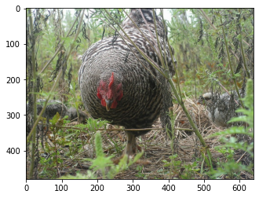

CompressAI-Vision uses fiftyone to handle datasets. Let’s take a closer
look into what this means.

You are probably familiar with the COCO API and the like, i.e a
directory structures that looks like this:

::

   annotations/
       json files
   train2007_dataset/
       image files
   ...
   ...

Then you have an API that reads those json files which have image
metadata, ground truths for images (bboxes, segmasks, etc.). Another
such example is the
`ImageFolder <https://pytorch.org/vision/stable/generated/torchvision.datasets.ImageFolder.html>`__
directory structure.

Fiftyone takes the obvious next step in handling datasets (metadata and
ground truths) and **uses a database**!

The datasets are saved into a *database* instead, namely into mongodb.
The interface to mongodb is handles seamlessly through fiftyone API.

Using a database has several obvious advantages. Some of these are: the
ability to share data among your research group, creating copies of the
dataset, adding more data to each sample (say detection results) etc.

The complication in using a database is that you need a *database
server*. Fiftyone makes this seamless as it start a stand-alone mongodb
server each time you type “import fiftyone”. Alternatively, you can use
a common (remote) mongodb server for your whole research group for
sharing data and/or if you’re working in a supercomputing / grid
environment.

Let’s take a closer look:

.. code:: ipython3

    # image tool imports
    from PIL import Image
    import matplotlib.pyplot as plt

.. code:: ipython3

    # fiftyone
    import fiftyone as fo
    import fiftyone.zoo as foz

Lets take a look at the datasets registered to fiftyone:

.. code:: ipython3

    fo.list_datasets()

.. parsed-literal::

    ['mpeg-vcm-detection',
     'mpeg-vcm-detection-dummy',
     'mpeg-vcm-segmentation',
     'open-images-v6-validation',
     'quickstart']

Let’s get a handle to a dataset:

.. code:: ipython3

    dataset=fo.load_dataset("quickstart")

Let’s see how many *samples* we have in it:

.. code:: ipython3

    len(dataset)

.. parsed-literal::

    200

Let’s take a look at the first sample:

.. code:: ipython3

    sample=dataset.first()
    print(sample)

.. parsed-literal::

    <Sample: {
        'id': '634472860faf93a9a586c9c4',
        'media_type': 'image',
        'filepath': '/home/sampsa/fiftyone/quickstart/data/000880.jpg',
        'tags': BaseList(['validation']),
        'metadata': None,
        'ground_truth': <Detections: {
            'detections': BaseList([
                <Detection: {
                    'id': '5f452471ef00e6374aac53c8',
                    'attributes': BaseDict({}),
                    'tags': BaseList([]),
                    'label': 'bird',
                    'bounding_box': BaseList([
                        0.21084375,
                        0.0034375,
                        0.46190625,
                        0.9442083333333334,
                    ]),
                    'mask': None,
                    'confidence': None,
                    'index': None,
                    'area': 73790.37944999996,
                    'iscrowd': 0.0,
                }>,
                <Detection: {
                    'id': '5f452471ef00e6374aac53c9',
                    'attributes': BaseDict({}),
                    'tags': BaseList([]),
                    'label': 'bird',
                    'bounding_box': BaseList([
                        0.74946875,
                        0.489375,
                        0.2164375,
                        0.23183333333333334,
                    ]),
                    'mask': None,
                    'confidence': None,
                    'index': None,
                    'area': 3935.7593000000006,
                    'iscrowd': 0.0,
                }>,
                <Detection: {
                    'id': '5f452471ef00e6374aac53ca',
                    'attributes': BaseDict({}),
                    'tags': BaseList([]),
                    'label': 'bird',
                    'bounding_box': BaseList([
                        0.044234375,
                        0.5282083333333333,
                        0.151390625,
                        0.14145833333333335,
                    ]),
                    'mask': None,
                    'confidence': None,
                    'index': None,
                    'area': 4827.32605,
                    'iscrowd': 0.0,
                }>,
            ]),
        }>,
        'uniqueness': 0.8175834390151201,
        'predictions': <Detections: {
            'detections': BaseList([
                <Detection: {
                    'id': '5f452c60ef00e6374aad9394',
                    'attributes': BaseDict({}),
                    'tags': BaseList([]),
                    'label': 'bird',
                    'bounding_box': BaseList([
                        0.22192673683166503,
                        0.06093006531397502,
                        0.4808845520019531,
                        0.8937615712483724,
                    ]),
                    'mask': None,
                    'confidence': 0.9750854969024658,
                    'index': None,
                }>,
                <Detection: {
                    'id': '5f452c60ef00e6374aad9395',
                    'attributes': BaseDict({}),
                    'tags': BaseList([]),
                    'label': 'bird',
                    'bounding_box': BaseList([
                        0.3962469816207886,
                        0.006943931678930918,
                        0.27418792247772217,
                        0.46793556213378906,
                    ]),
                    'mask': None,
                    'confidence': 0.759726881980896,
                    'index': None,
                }>,
                <Detection: {
                    'id': '5f452c60ef00e6374aad9396',
                    'attributes': BaseDict({}),
                    'tags': BaseList([]),
                    'label': 'bird',
                    'bounding_box': BaseList([
                        0.02506386339664459,
                        0.548487663269043,
                        0.16438478231430054,
                        0.16736234029134114,
                    ]),
                    'mask': None,
                    'confidence': 0.6569182276725769,
                    'index': None,
                }>,
                <Detection: {
                    'id': '5f452c60ef00e6374aad9397',
                    'attributes': BaseDict({}),
                    'tags': BaseList([]),
                    'label': 'bird',
                    'bounding_box': BaseList([
                        0.4889101028442383,
                        0.009576511383056641,
                        0.13802199363708495,
                        0.2093157132466634,
                    ]),
                    'mask': None,
                    'confidence': 0.2359301745891571,
                    'index': None,
                }>,
                <Detection: {
                    'id': '5f452c60ef00e6374aad9398',
                    'attributes': BaseDict({}),
                    'tags': BaseList([]),
                    'label': 'elephant',
                    'bounding_box': BaseList([
                        0.015171945095062256,
                        0.555288823445638,
                        0.1813342332839966,
                        0.15938574473063152,
                    ]),
                    'mask': None,
                    'confidence': 0.221974179148674,
                    'index': None,
                }>,
                <Detection: {
                    'id': '5f452c60ef00e6374aad9399',
                    'attributes': BaseDict({}),
                    'tags': BaseList([]),
                    'label': 'bear',
                    'bounding_box': BaseList([
                        0.017808181047439576,
                        0.5488224665323893,
                        0.17450940608978271,
                        0.16891117095947267,
                    ]),
                    'mask': None,
                    'confidence': 0.1965726613998413,
                    'index': None,
                }>,
                <Detection: {
                    'id': '5f452c60ef00e6374aad939a',
                    'attributes': BaseDict({}),
                    'tags': BaseList([]),
                    'label': 'elephant',
                    'bounding_box': BaseList([
                        0.16558188199996948,
                        0.5723957061767578,
                        0.09993256330490112,
                        0.10098978678385416,
                    ]),
                    'mask': None,
                    'confidence': 0.18904592096805573,
                    'index': None,
                }>,
                <Detection: {
                    'id': '5f452c60ef00e6374aad939b',
                    'attributes': BaseDict({}),
                    'tags': BaseList([]),
                    'label': 'sheep',
                    'bounding_box': BaseList([
                        0.213010573387146,
                        0.05354320605595907,
                        0.5153374671936035,
                        0.8933518091837566,
                    ]),
                    'mask': None,
                    'confidence': 0.11480894684791565,
                    'index': None,
                }>,
                <Detection: {
                    'id': '5f452c60ef00e6374aad939c',
                    'attributes': BaseDict({}),
                    'tags': BaseList([]),
                    'label': 'bird',
                    'bounding_box': BaseList([
                        0.29751906394958494,
                        0.010790024201075237,
                        0.3315577507019043,
                        0.34026527404785156,
                    ]),
                    'mask': None,
                    'confidence': 0.11089690029621124,
                    'index': None,
                }>,
                <Detection: {
                    'id': '5f452c60ef00e6374aad939d',
                    'attributes': BaseDict({}),
                    'tags': BaseList([]),
                    'label': 'elephant',
                    'bounding_box': BaseList([
                        0.08351035118103027,
                        0.5574632008870443,
                        0.18209288120269776,
                        0.1426785151163737,
                    ]),
                    'mask': None,
                    'confidence': 0.0971052274107933,
                    'index': None,
                }>,
                <Detection: {
                    'id': '5f452c60ef00e6374aad939e',
                    'attributes': BaseDict({}),
                    'tags': BaseList([]),
                    'label': 'bird',
                    'bounding_box': BaseList([
                        0.4461814880371094,
                        0.0007838249827424685,
                        0.209574556350708,
                        0.309667714436849,
                    ]),
                    'mask': None,
                    'confidence': 0.08403241634368896,
                    'index': None,
                }>,
                <Detection: {
                    'id': '5f452c60ef00e6374aad939f',
                    'attributes': BaseDict({}),
                    'tags': BaseList([]),
                    'label': 'bird',
                    'bounding_box': BaseList([
                        0.5395165920257569,
                        0.034476550420125325,
                        0.07703280448913574,
                        0.16296254793802897,
                    ]),
                    'mask': None,
                    'confidence': 0.07699568569660187,
                    'index': None,
                }>,
                <Detection: {
                    'id': '5f452c60ef00e6374aad93a0',
                    'attributes': BaseDict({}),
                    'tags': BaseList([]),
                    'label': 'bear',
                    'bounding_box': BaseList([
                        0.217216157913208,
                        0.05954849322636922,
                        0.49451656341552735,
                        0.8721434275309244,
                    ]),
                    'mask': None,
                    'confidence': 0.058097004890441895,
                    'index': None,
                }>,
                <Detection: {
                    'id': '5f452c60ef00e6374aad93a1',
                    'attributes': BaseDict({}),
                    'tags': BaseList([]),
                    'label': 'sheep',
                    'bounding_box': BaseList([
                        0.018094074726104737,
                        0.5562847137451172,
                        0.17362892627716064,
                        0.15742950439453124,
                    ]),
                    'mask': None,
                    'confidence': 0.0519101656973362,
                    'index': None,
                }>,
            ]),
        }>,
    }>

Here we can see that there are bbox ground truths. Please also note that
fiftyone/mongodb does *not* save the images themselves but just their
path. When running mAP evaluations on a dataset, detection results can
be saved into the same database (say, with key “detections”) and then
ground truths and detections can be compared within the same dataset
(instead of writing lots of intermediate files on the disk like with
COCO API or with the tensorflow tools).

Let’s load an image:

.. code:: ipython3

    plt.imshow(Image.open(sample["filepath"]))

.. parsed-literal::

    <matplotlib.image.AxesImage at 0x7fabd4fed430>

Let’s see a summary of the dataset and what kind of fields each samples
has:

.. code:: ipython3

    print(dataset)

.. parsed-literal::

    Name:        quickstart
    Media type:  image
    Num samples: 200
    Persistent:  True
    Tags:        []
    Sample fields:
        id:           fiftyone.core.fields.ObjectIdField
        filepath:     fiftyone.core.fields.StringField
        tags:         fiftyone.core.fields.ListField(fiftyone.core.fields.StringField)
        metadata:     fiftyone.core.fields.EmbeddedDocumentField(fiftyone.core.metadata.ImageMetadata)
        ground_truth: fiftyone.core.fields.EmbeddedDocumentField(fiftyone.core.labels.Detections)
        uniqueness:   fiftyone.core.fields.FloatField
        predictions:  fiftyone.core.fields.EmbeddedDocumentField(fiftyone.core.labels.Detections)

You can visualize the whole dataset conveniently with:

::

   session = fo.lauch_app(dataset)

For more info, please visit `fiftyone
documentation <https://voxel51.com/docs/fiftyone/>`__

